Credit Portfolio Default Rate Forecasting & Monitoring System

A production-style time series forecasting system designed to predict monthly portfolio default rates using Lending Club loan data.

The project simulates how forecasting systems are implemented in financial institutions by including:

Large scale data engineering

Time series diagnostics

Baseline forecasting models

ARIMA models

Machine learning forecasting models

Walk-forward backtesting

Prediction intervals

Forecast monitoring system

Business Objective

Financial institutions must continuously monitor portfolio default rates to understand credit risk exposure and make informed lending decisions.

This project develops a system capable of:

Forecasting monthly portfolio default rates

Estimating forecast uncertainty

Monitoring model performance after deployment

Dataset

The dataset used is the Lending Club loan dataset, which contains loan-level information including loan issuance date and loan status.

Dataset characteristics:

Size: ~1.18 GB

Millions of loan records

Aggregated into monthly portfolio default rate

To handle the large dataset on limited hardware (8GB RAM), the data was processed using chunk-based loading.

Default Rate Time Series

 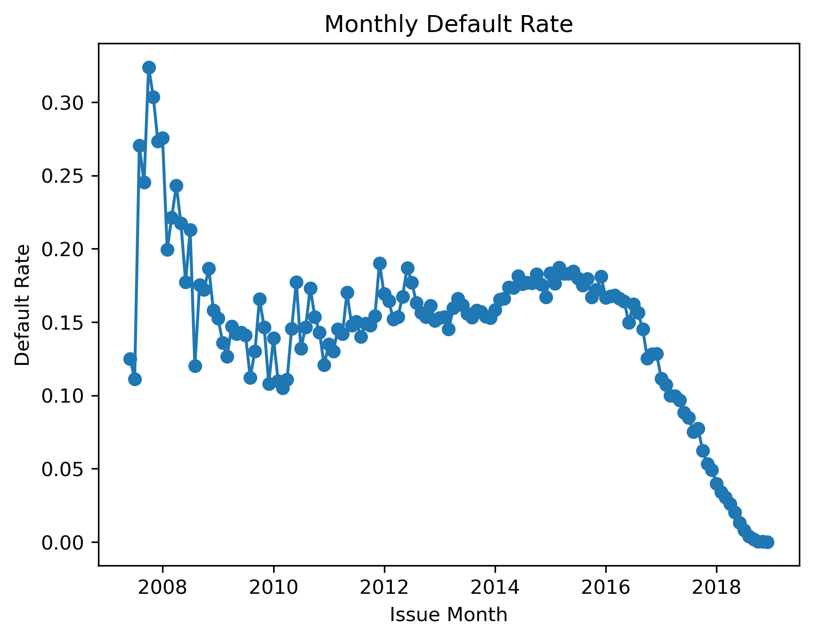 

The loan-level dataset was aggregated into a monthly default rate time series, which serves as the forecasting target.

Rolling Mean Analysis

 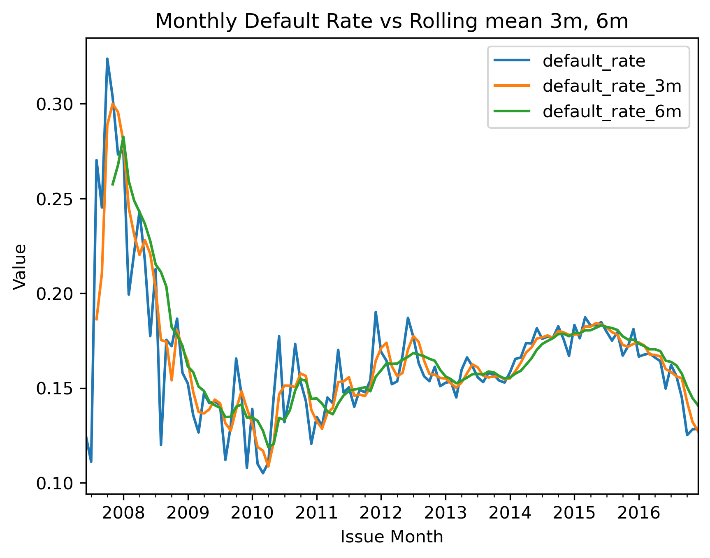 

Rolling averages help identify the underlying trend and smooth short-term fluctuations in the time series.

Rolling Volatility

 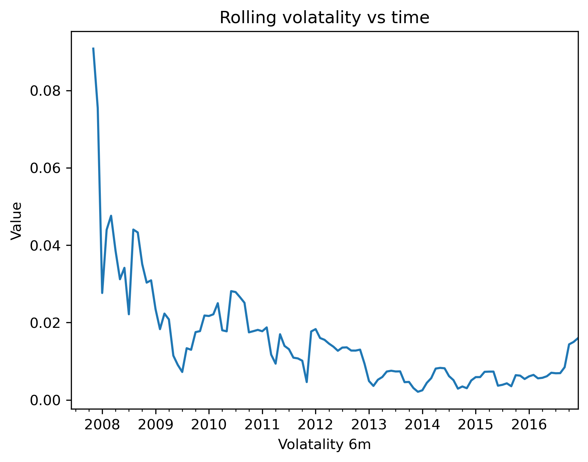 

Rolling volatility analysis reveals periods of increased variability in the default rate.

Autocorrelation Analysis
Autocorrelation Function (ACF)

 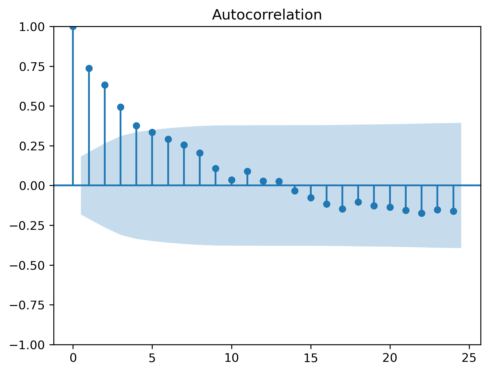 

Partial Autocorrelation Function (PACF)

 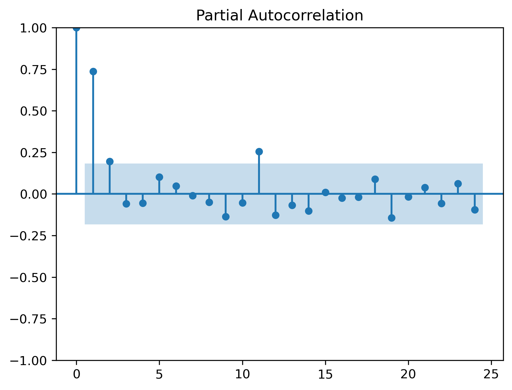 

ACF and PACF plots were used to determine appropriate ARIMA model parameters.

Baseline Forecasting Models

Baseline models were implemented to establish reference performance levels.

Models tested:

Naive Forecast

Moving Average (3 months)

Moving Average (6 months)

These simple models provide a benchmark for evaluating more complex forecasting approaches.

ARIMA Models

Several ARIMA configurations were tested based on ACF and PACF analysis.

Tested models:

ARIMA(1,0,0)

  

ARIMA(1,0,1)

 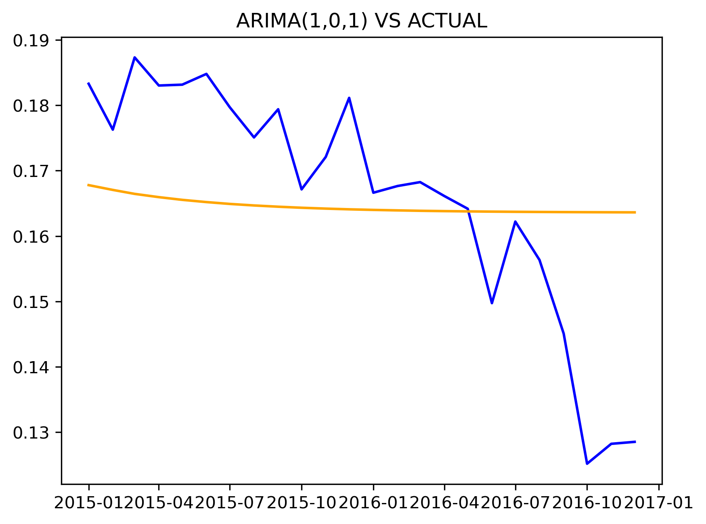 

ARIMA(2,0,0)

 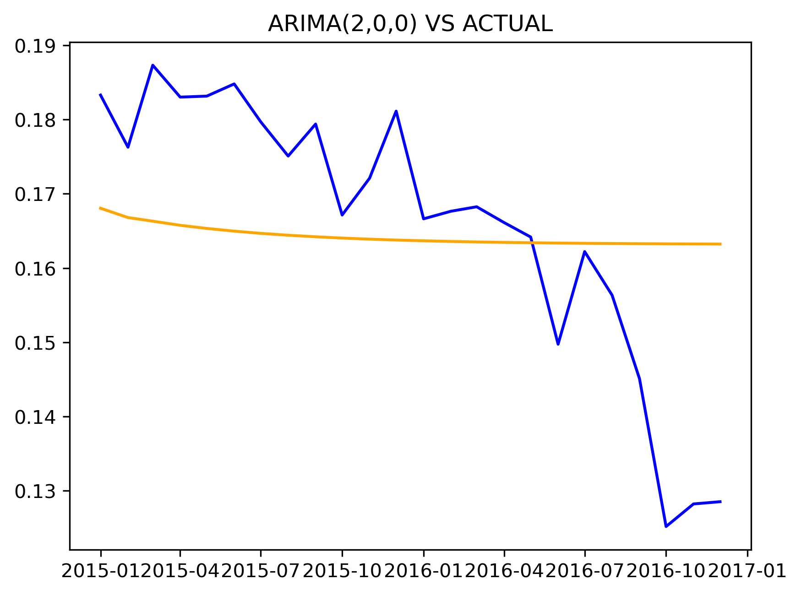 

ARIMA(2,0,0) with differencing

  

ARIMA(2,0,1)

  

However, ARIMA models did not outperform baseline models.

Possible reasons include:

Limited dataset size

Weak autoregressive structure

Relatively stable default rate series

Machine Learning Forecasting Models

To capture nonlinear relationships, machine learning models were implemented.

Models evaluated:

LightGBM

XGBoost

LightGBM Forecast Performance

 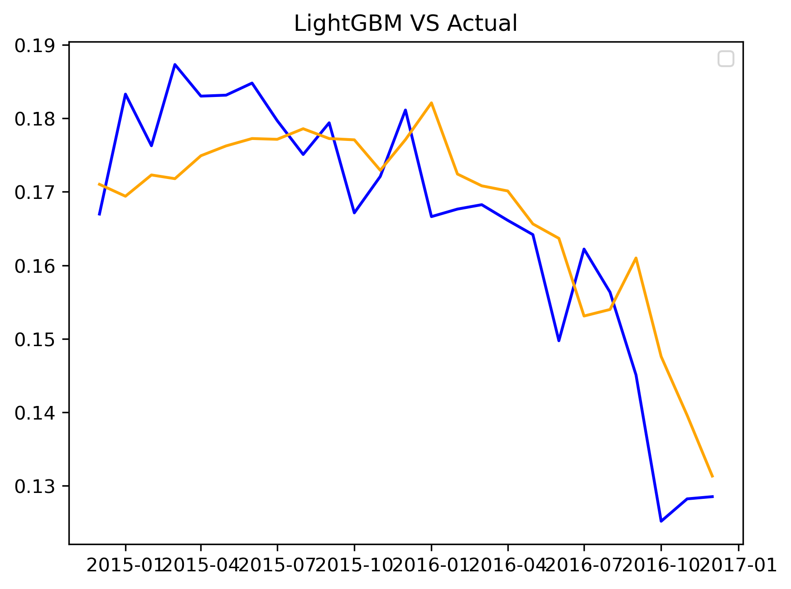 

XGBoost Forecast Performance

 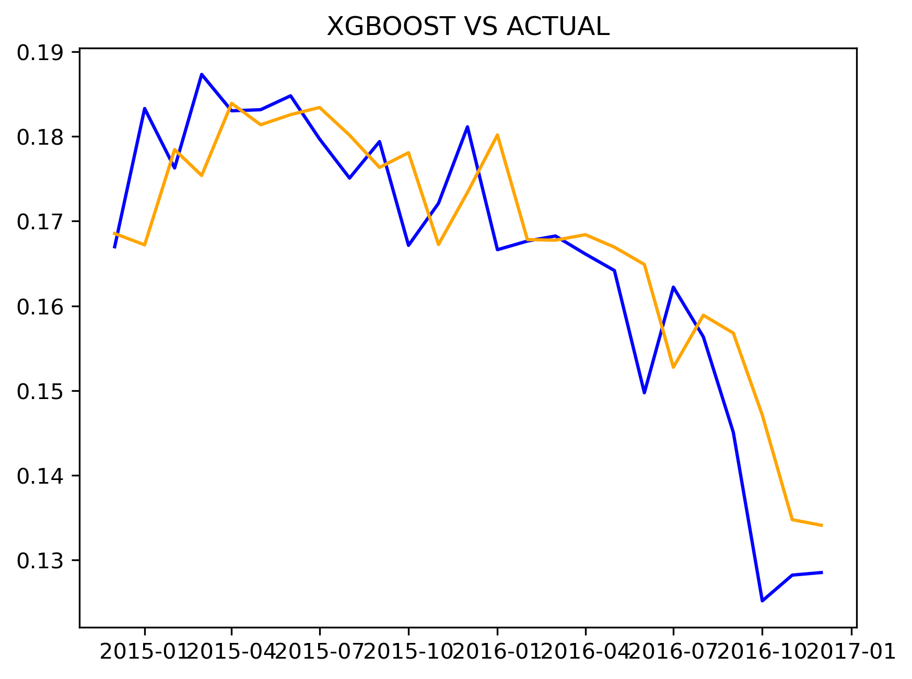 

XGBoost achieved the best forecasting accuracy among all models tested.

Feature Engineering

Machine learning models require structured input features.

The following features were created:

Lag Features

Lag features capture previous observations of the time series.

lag_1 → lag_12

Using 12 lags allows the model to capture patterns from the previous 12 months.

Rolling Statistics

Additional features were introduced:

3-month rolling mean

6-month rolling mean

6-month rolling standard deviation

These features help capture:

short-term trends

volatility

seasonal patterns

Walk-Forward Backtesting

Forecast models were evaluated using walk-forward validation, which simulates real forecasting conditions.

Process:

Train model
Predict next month
Append new observation
Repeat

Evaluation metrics used:

RMSE

MAE

MAPE

Residual Diagnostics
Residual Time Plot

 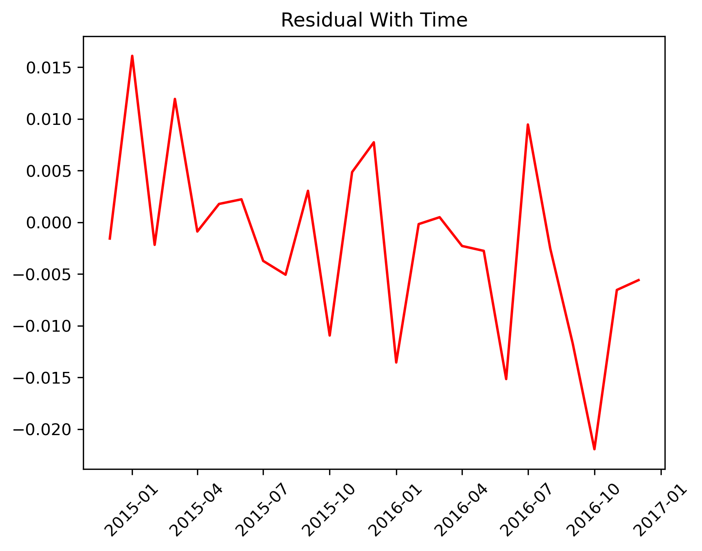 

Residual Distribution

 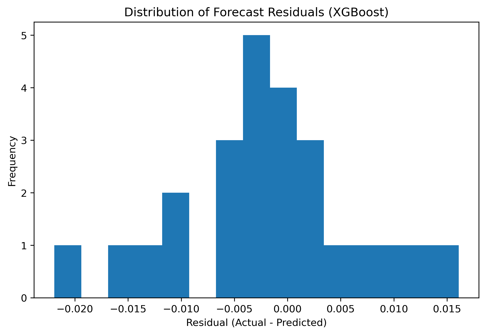 

Residual analysis showed:

Mean residual close to zero

No strong autocorrelation

Approximate white-noise behavior

Forecast Pipeline

A production-style forecasting pipeline was implemented.

Pipeline steps:

Load latest dataset
Train XGBoost model
Generate next-month forecast
Estimate prediction interval
Save forecast

The model uses the most recent 8 years of data for training.

Prediction Intervals

Prediction intervals were implemented using residual bootstrap.

Process:

sample historical residuals
add residuals to forecast
compute percentile bounds

Example output:

Forecast Date	Forecast	Lower 95%	Upper 95%
2017-01	0.129	0.114	0.140
Forecast Monitoring System

A monitoring system evaluates forecasts once new actual data becomes available.

Metrics tracked:

Mean Absolute Error (MAE)

Root Mean Squared Error (RMSE)

Forecast Bias

Prediction interval coverage

This enables continuous monitoring of model performance.

Project Structure
credit-default-forecasting-system

data/
    raw/
    processed/
    forecasts/
    monitoring/

notebooks/
    data exploration
    modeling experiments

src/
    data_engineering/
    features/
    models/
    evaluation/
    forecasting/
    uncertainty/
    monitoring/

reports/
    figures/
How to Run

Clone the repository:

git clone <repository_link>
cd credit-default-forecasting-system

Install dependencies:

pip install -r requirements.txt

Run forecasting pipeline:

python src/forecasting/forecast_pipeline.py

Run monitoring system:

python src/monitoring/forecast_monitor.py
Future Improvements

Potential enhancements include:

Incorporating macroeconomic indicators

Deep learning models (LSTM)

Multi-step forecasting

Automated model retraining

Drift detection